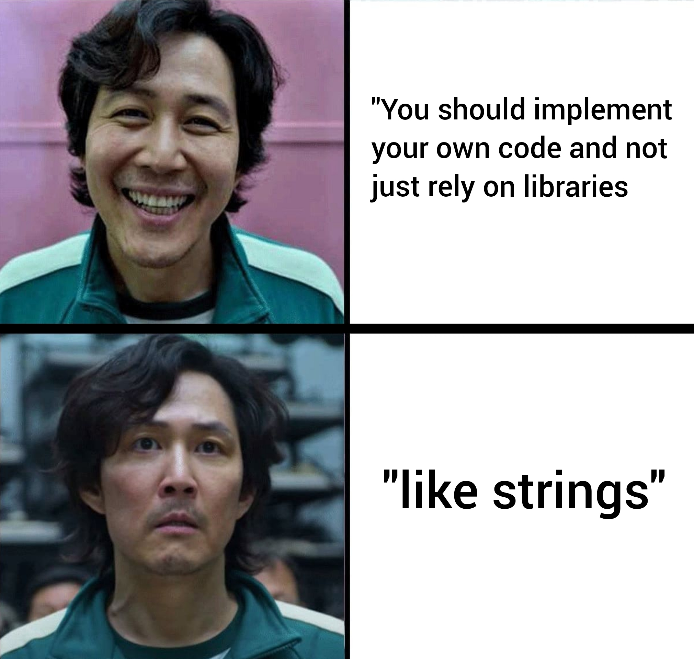

<h1 align="center">
<strong>AUT_BP_2024_Fall Homework 3</strong>
</h1>

<strong> Deadline: 25th of Aban - Friday - 23:59 o'clock</strong>

---

## 1st Question: Sort Words in Alphabetical Order

### Description

Write a program that takes a sentence as input, removes any punctuation attached to the beginning or end of each word, and returns a sentence with the words sorted in alphabetical order. 

The program should:
1. Take a sentence as input.
2. Break down the sentence into individual words.
3. Remove any punctuation marks attached to the start or end of each word. (only basic punctuation: commas, periods, exclamation marks, and question marks.)
4. Sort the words alphabetically, ignoring case.
5. Output the sorted words as a single sentence.

### Example of Input/Output

- **Example 1:**
    - **Input:** `Hello, world! Welcome to programming.`
    - **Output:** `Hello programming to Welcome world`
  
- **Example 2:**
    - **Input:** `Zebra! apple, Orange... Banana`
    - **Output:** `apple Banana Orange Zebra`

- **Example 3 (Edge Case):**
    - **Input:** `single-word`
    - **Output:** `single-word`

- **Example 4 (Empty Input):**
    - **Input:** ``
    - **Output:** `` (No output as there is no input)

### Edge Cases and Pitfalls

1. **Words with Attached Punctuation**: Students should ensure punctuation is removed only from the beginning or end of each word, not within the word itself. For instance, in `end-of-line,`, only the comma should be removed, leaving `end-of-line` intact.

2. **Uppercase and Lowercase Handling**: Sorting should ignore case, meaning Apple and apple should be treated the same during sorting. They should be ordered as `apple` and `Apple` if both are present.

3. **Empty Input**: If the input is an empty string, the program should handle it by outputting an empty response without errors.

4. **Handling Multiple Spaces**: Extra spaces between words should not affect the result. For example, if the input contains `Hello   world!`, the output should handle the words correctly without additional spaces.

5. **Single Word Input**: If there is only one word, with or without punctuation, the output should be the word itself, as no sorting is needed.

6. **Punctuation Inside Words**: Words with hyphens or apostrophes within them (like `don't` or `co-op`) should retain the punctuation if it’s part of the word's structure, rather than a surrounding punctuation mark.

---

## 2nd Question: Hashtag Generator

### Description

Write a program that takes a sentence as input and transforms it into a hashtag. The program should:

1. Take a sentence from the user.
2. Remove any spaces between words in the sentence.
3. Capitalize the first letter of each word.
4. Add a `#` symbol at the beginning of the transformed sentence to create a hashtag.

The result should be in the format `#CamelCase` where each word in the sentence starts with an uppercase letter, and there are no spaces or punctuation marks in the hashtag.

### Example of Input/Output

- **Example 1:**
    - **Input:** `joe rogan experience`
    - **Output:** `#JoeRoganExperience`
  
- **Example 2:**
    - **Input:** `open AI Chat GPT`
    - **Output:** `#OpenAIChatGPT`

- **Example 3:**
    - **Input:** ` coding is fun `
    - **Output:** `#CodingIsFun` (Note: extra spaces at the beginning or end should be ignored.)

- **Example 4 (Edge Case):**
    - **Input:** ``
    - **Output:** `` (An empty input should result in no hashtag generated.)

### Edge Cases and Pitfalls

1. **Handling Leading and Trailing Spaces**: If the input has extra spaces at the beginning or end, the program should ignore these spaces to avoid unnecessary empty words or errors in the transformation.

2. **Empty Input**: If the input is empty, the program should handle this by returning an empty string.

3. **Single Word Input**: If the input contains a single word, the program should still add the `#` symbol and capitalize the first letter if needed. For example, `hello` should become `#Hello`.

4. **All Uppercase or Lowercase Input**: The program should ignore the original capitalization and format all words in CamelCase, ensuring the first letter of each word is capitalized. For example, `HELLO world` should convert to `#HelloWorld`.

---

## 3rd Question: Password Validator

### Description

Write a program that takes a password as input and checks if it meets the following validation requirements:

1. **No Whitespace**: The password must not contain any spaces.
2. **At Least One Uppercase Letter**: The password must contain at least one uppercase letter (A-Z).
3. **At Least One Lowercase Letter**: The password must contain at least one lowercase letter (a-z).
4. **At Least One Number**: The password must contain at least one digit (0-9).
5. **At Least One Punctuation Character**: The password must contain at least one punctuation character, such as `!`, `@`, `#`, `$`, `%`, etc.
6. **All Characters Must Be Printable**: All characters in the password must be printable. Non-printable characters, like control characters, are not allowed.
7. **Minimum Length of 8 Characters**: The password must be at least 8 characters long.

The program should:

1. Check each of these conditions for the input string.
2. Output a message for each missing requirement if any are unmet.
3. Output a validation success message if the password meets all requirements.

### Example of Input/Output

- **Example 1:**
    - **Input:** `Password123!`
    - **Output:** `Password is valid.`
  
- **Example 2:**
    - **Input:** `pass`
    - **Output:** 
        - `Password must contain at least one uppercase letter.`
        - `Password must contain at least one punctuation character.`
        - `Password must be at least 8 characters long.`

- **Example 3:**
    - **Input:** `Password `
    - **Output:** 
        - `Password must not contain whitespace.`
        - `Password must contain at least one number.`
        - `Password must contain at least one punctuation character.`

- **Example 4 (Edge Case):**
    - **Input:** ``
    - **Output:** 
        - `Password must contain at least one uppercase letter.`
        - `Password must contain at least one lowercase letter.`
        - `Password must contain at least one number.`
        - `Password must contain at least one punctuation character.`
        - `Password must be at least 8 characters long.`

### Edge Cases and Pitfalls

1. **Empty Input**: An empty input will fail all checks (Except whitespace check), so the program should be prepared to display all validation messages if no criteria are met.

2. **Whitespace Characters**: Spaces, tabs, and newline characters are considered whitespace and must trigger the “No whitespace” requirement message if any of these are present.

3. **Minimum Length Check**: Students should check length before other conditions to avoid unnecessary checks for short inputs.

4. **Multiple Error Messages**: If the password fails multiple checks, the program should be able to output each missing requirement clearly and separately.

---

## 4th Question: Palindrome Sentence Check

### Description

Write a program that takes a sentence as input and checks if it is a palindrome. A palindrome is a sequence of characters that reads the same forward and backward. In this question, the program should:

1. Ignore any whitespace within the sentence.
2. Ignore any punctuation marks (e.g., commas, periods, exclamation marks).

The program should only consider alphanumeric characters and should treat uppercase and lowercase letters as equivalent (i.e., it is case-insensitive).

### Example of Input/Output

- **Example 1:**
    - **Input:** `A man, a plan, a canal, Panama`
    - **Output:** `The sentence is a palindrome.`
  
- **Example 2:**
    - **Input:** `Hello, World!`
    - **Output:** `The sentence is not a palindrome.`

- **Example 3:**
    - **Input:** `No lemon, no melon`
    - **Output:** `The sentence is a palindrome.`

- **Example 4 (Edge Case):**
    - **Input:** ``
    - **Output:** `The sentence is a palindrome.` (An empty input can be considered a palindrome by definition since there are no characters to contradict symmetry.)

### Edge Cases and Pitfalls

1. **Case Insensitivity**: Ensure the program converts all characters to the same case (either uppercase or lowercase) to avoid false negatives caused by case differences.

2. **Ignoring Non-Alphanumeric Characters**: The program must skip all punctuation and whitespace. For example, `Madam, in Eden, I’m Adam` should pass as a palindrome, ignoring commas, apostrophes, and spaces.

3. **Empty Input**: An empty string can be considered a palindrome since there is no content to violate symmetry. The program should handle this without error.

4. **Single Character Input**: Any single character (e.g., `a`) is inherently a palindrome. The program should recognize this as valid without extra checks.

---

## 5th Question: Caesar Cipher Encrypt/Decrypt

### Description

Write a program that allows the user to encrypt or decrypt a message using the Caesar Cipher method. The Caesar Cipher shifts each letter in the message by a specified number of positions. For encryption, each character is shifted forward in the alphabet, while for decryption, each character is shifted backward.

The program should:

1. Ask the user if they want to **encrypt** or **decrypt** a message.
2. Ask the user for the **shift number**. This is the number of positions each letter will be moved in the alphabet.
3. Ask the user to enter the **text** they want to encrypt or decrypt.
4. Output the encrypted or decrypted message based on the user's selection.

### Steps for Implementation

1. **Shift Character**: For each character in the text, if it is an alphabetic character, shift it by the specified number in the direction (forward or backward) specified by the user.
   - If encrypting, move the letter forward by the shift number.
   - If decrypting, move the letter backward by the shift number.
2. **Wrap Around**: If shifting goes beyond 'Z' or 'z', it should wrap around to the beginning of the alphabet (i.e., after 'Z', it wraps back to 'A'; after 'z', it wraps back to 'a').
3. **Non-Alphabetic Characters**: Non-alphabetic characters should remain unchanged in the output.

### Example of Input/Output

- **Example 1 (Encryption):**
    - **Input:**
        - Action: `encrypt`
        - Shift number: `3`
        - Text: `Hello World`
    - **Output:** `Khoor Zruog`
  
- **Example 2 (Decryption):**
    - **Input:**
        - Action: `decrypt`
        - Shift number: `3`
        - Text: `Khoor Zruog`
    - **Output:** `Hello World`

- **Example 3 (Edge Case):**
    - **Input:**
        - Action: `encrypt`
        - Shift number: `52` (Double the alphabet length)
        - Text: `Hello`
    - **Output:** `Hello` (A shift of 52 results in no change since it is a complete rotation)

### Edge Cases and Pitfalls

1. **Shift Larger Than 26**: A shift of 26 (or multiples of 26) results in no change to the message since the alphabet wraps around completely. For simplicity, the program can use `shift % 26` to ensure efficient handling of large shift numbers.

2. **Case Sensitivity**: Ensure the program keeps the case of each letter intact. For example, `'H'` should remain uppercase after shifting, while `'h'` should remain lowercase.

5. **Empty Input**: If the input text is empty, the program should  return an empty string without error.

---

## 6th Question: Combine Two Arrays and Remove Duplicates

### Description

Write a program that takes two arrays as input, combines them into a third array, and removes any duplicate elements from the result. The final array should contain all unique elements from both input arrays. The input will be provided as follows:

1. First, take the **size of the first array**.
2. Then, take the **elements of the first array**.
3. Next, take the **size of the second array**.
4. Then, take the **elements of the second array**.
5. Combine both arrays, remove any duplicate elements, and output the resulting array.

The output should display the unique elements in a comma-separated format within square brackets.

### Example of Input/Output

- **Example 1:**
    - **Input:**
        - Size of Array 1: `4`
        - Array 1: `1 2 3 4`
        - Size of Array 2: `4`
        - Array 2: `3 4 5 6`
    - **Output:** `[1, 2, 3, 4, 5, 6]`
  
- **Example 2:**
    - **Input:**
        - Size of Array 1: `3`
        - Array 1: `[7, 8, 9]`
        - Size of Array 2: `4`
        - Array 2: `[9, 10, 7, 11]`
    - **Output:** `[7, 8, 9, 10, 11]`

- **Example 3 (Edge Case):**
    - **Input:**
        - Size of Array 1: `0`
        - Size of Array 2: `4`
        - Array 2: `1 2 3 2`
    - **Output:** `[1, 2, 3]` (If one array is empty, the result should be the unique elements of the non-empty array.)

### Edge Cases and Pitfalls

1. **Empty Arrays**: If one or both input arrays are empty, the program should handle this gracefully. For example, if both arrays are empty, the output should be an empty array: `[]`.

2. **Handling All Duplicates**: If both arrays contain the same elements, the resulting array should only have one instance of each element. For example, combining `1 1 1` and `1 1` should output `[1]`.

3. **Output Format**: The output should be a single line with the elements in square brackets, separated by commas, for example: `[1, 2, 3, 4, 5]`.

---

## Contact

If you have any questions regarding the homework, feel free to reach out:

-   **Teaching Assistant**: Seyyed Mohammad Hamidi
-   **Sub TA**: Milad Masrooghi [masrooghi24m](https://github.com/masrooghi24m)
-   **Telegram Group**: [t.me/AUT_BP_Fall_2024](https://t.me/AUT_BP_Fall_2024)
-   **Github**: [github.com/smhamidi](https://github.com/smhamidi)

---

  

**Best Regards, [Hamidi](https://github.com/smhamidi)**
